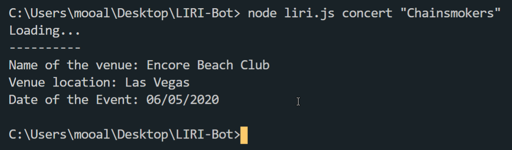
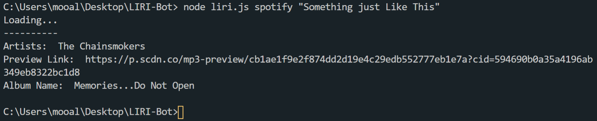
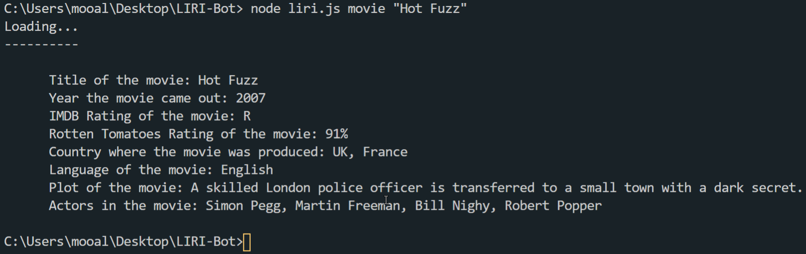
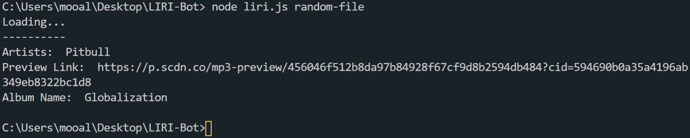

## LIRI-BOT (Language Interpretation and Recognition Interface)

LIRI is a command line node app that takes in parameters and gives you back data using Nodejs, npm packages request and API's such as spotify, bands and OMDb.

# Actions
-	concert
-	spotify
-	movie
-	random-file

## Getting Started: 
Download the "images" folder to visualize the each command. 
This will allow you to better see how LIRI works with each given command. 

## concert: 

This will search the Bands in Town Artist Events API for an artist and render the following information about each event to the terminal:

-	Name of the venue
-	Venue location
-	Date of the Event (use moment to format this as "MM/DD/YYYY")

## spotify: 

This will show the following information about the song in your terminal/bash window.

-	Artist(s)
-	A preview link of the song from Spotify
-	The album that the song is from

## movie: 

This will output the following information to your terminal/bash window:
-	Title of the movie.
-	Year the movie came out.
-	IMDB Rating of the movie.
-	Rotten Tomatoes Rating of the movie.
-	Country where the movie was produced.
-	Language of the movie.
-	Plot of the movie.
-	Actors in the movie.

## random-file: 

LIRI will use the text from “random.txt” and call on of LIRI’s commands. 
It should run Spotify for “Time Of Our Lives”. 

## Technologies Used:

* Javascript
* Node.js
* NPM packages
 -	axios
 -	moment
 -	fs
 -	node-spotify-api
* Spotify API
* OMDB API
* Bands In Town API

# LIRI Bot - Project Made by: Muhammad Ali.
